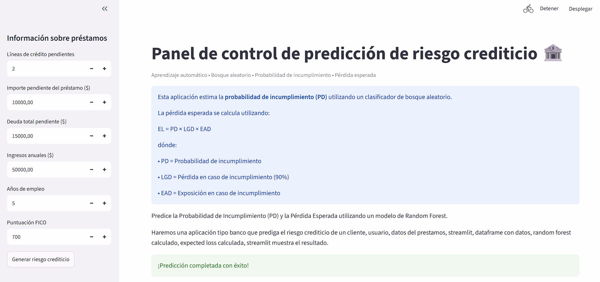
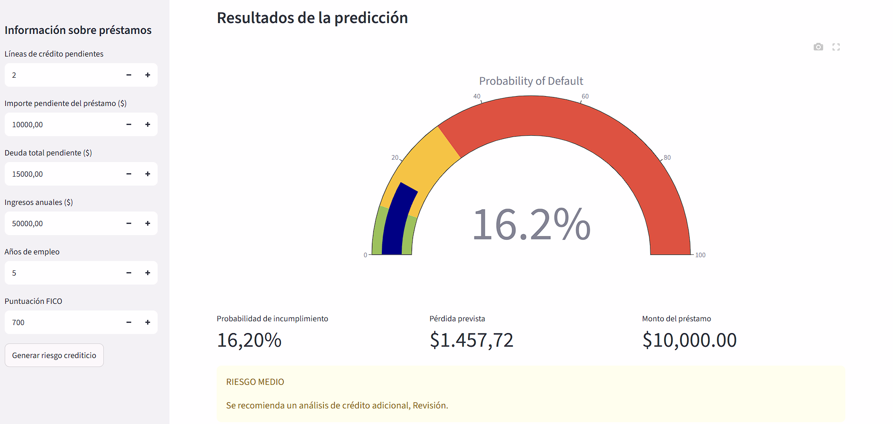
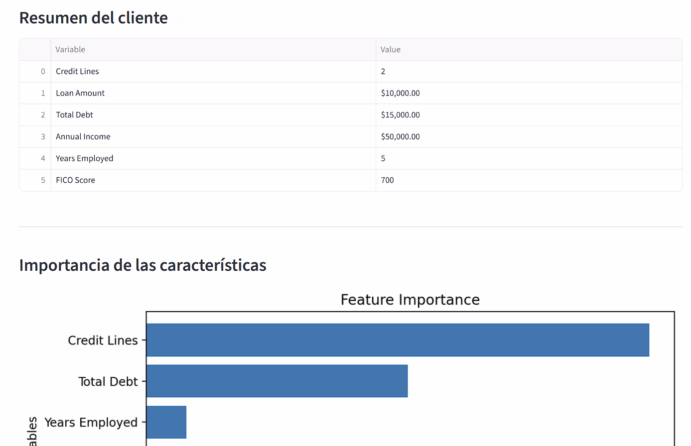
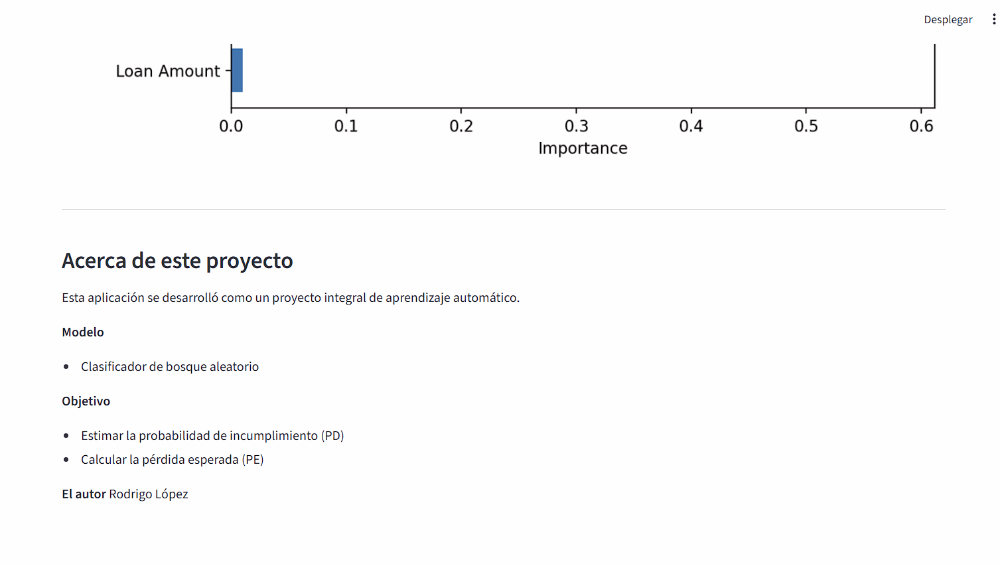
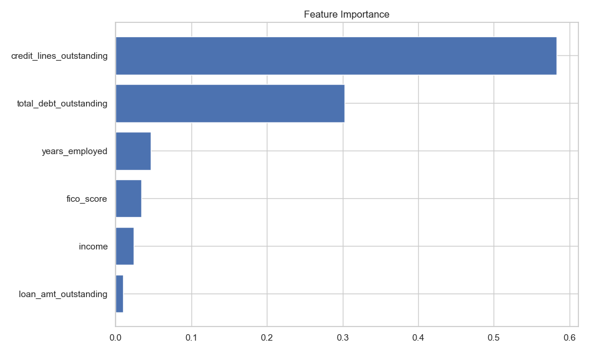

# Credit Risk Prediction using Random Forest

### Predicting Probability of Default (PD) and Expected Loss for Credit Risk Assessment

APP : https://credit-risk-pd-model-c5x57ljfiwtmzsv6fivgwr.streamlit.app/

## Project Overview

Financial institutions must evaluate the probability that a borrower will default before approving a loan.

This project develops a Credit Risk Prediction model using Random Forest to estimate the Probability of Default (PD). Based on this prediction and assuming a Recovery Rate of 10%, the project also calculates the Expected Loss (EL) for each loan.

The project includes:

- Exploratory Data Analysis
- Correlation Analysis
- Random Forest Classification
- Model Evaluation
- Feature Importance Analysis
- Expected Loss Calculator
- Interactive Streamlit Application

## Objectives

The main objectives of this project are:

- Analyze borrower information.
- Predict the Probability of Default.
- Evaluate the model using professional metrics.
- Identify the most important risk factors.
- Calculate Expected Loss.
- Deploy an interactive application using Streamlit.

## Dataset

The dataset contains approximately 10,000 borrowers.

Each observation includes:

- Credit Lines Outstanding
- Loan Amount Outstanding
- Total Debt Outstanding
- Income
- Years Employed
- FICO Score
- Default (Target Variable)

## Exploratory Data Analysis

### Default Distribution

---

### Correlation Matrix

## Machine Learning Model

Algorithm:

- Random Forest Classifier

Train/Test Split

- 80%
- 20%

Hyperparameters

- n_estimators = 300
- max_depth = 10
- min_samples_split = 10
- min_samples_leaf = 5

## Model Performance

Accuracy

99%

ROC AUC

0.9998

Classification Report

- Precision: 0.99
- Recall: 0.98
- F1 Score: 0.99

## Feature Importance

The Random Forest identified the following variables as the most relevant:

1. Credit Lines Outstanding
2. Total Debt Outstanding
3. Years Employed
4. FICO Score
5. Income
6. Loan Amount Outstanding

## Expected Loss

The project estimates the Expected Loss using

Expected Loss = PD × LGD × EAD

where

PD = Probability of Default

LGD = 90%

EAD = Loan Amount Outstanding

## Technologies

- Python
- Pandas
- NumPy
- Matplotlib
- Scikit-Learn
- Joblib
- Streamlit

## Dashboard Preview

---

#  Dataset

The dataset contains historical loan information used to train a credit risk model.

### Dataset Characteristics

- **Rows:** 10,000
- **Target Variable:** `default`
- **Problem Type:** Binary Classification

Each row represents one loan applicant and includes financial and credit-related information.

The objective is to predict whether a borrower will default on a loan.                           
## Author

Rodrigo López Dulcey

Finance & International Business

Aspiring Data Analyst Master

correo : rodri561010@gmail.com
